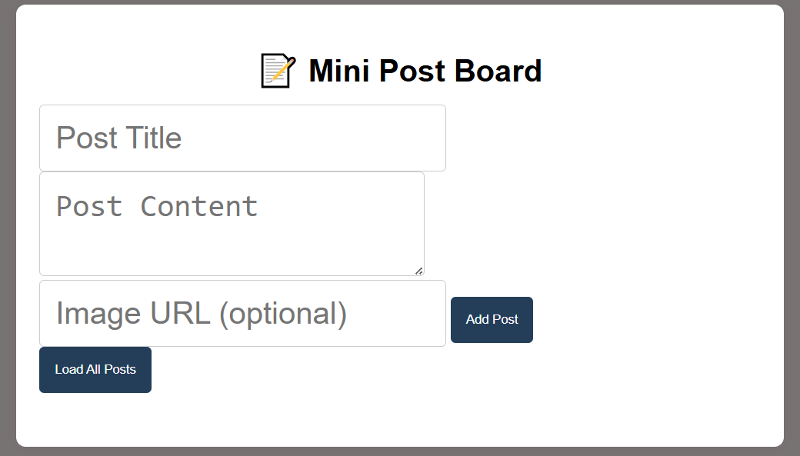

# Post-Manager

I created the Mini Post Board as a simple web app to practice DOM manipulation, handling user events, and implementing basic CRUD operations. Users can add, edit, and delete posts, each with a title, content, and optional image. All posts are saved in Local Storage, so they remain even after refreshing the page. 

